Regions Adjacency Graphs Segmentation Comparison
------------------------------------------------

This post tries to compare the 3 different RAG based segmentation algorithms implemented during this years GSoC. For a better comparison, all RAGs were created from LAB color space images using the `rgb2lab` function. 

Here are the example inputs.

## Input Images


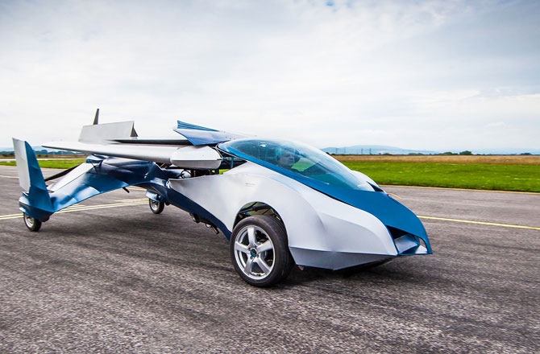

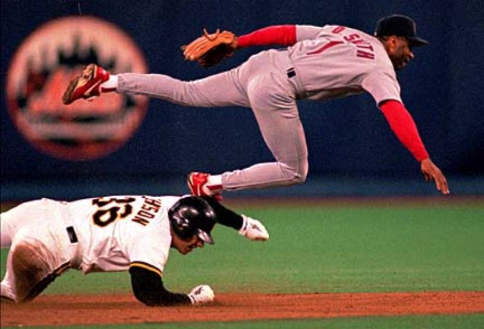


## Best Output for Each Method
First I will list out the best segmentation output that each of methods returned. This means that for all the outputs below I manually adjusted the thresholds to get optimum results.

### RAG Thresholding
Here is the code used.

```python
img = data.coffee()
img_lab = color.rgb2lab(img)
labels = segmentation.slic(img, compactness=30, n_segments=400)
rag_dist = graph.rag_mean_color(img_lab, labels)
labels_new = graph.cut_threshold(labels, rag_dist, 12)
out = color.label2rgb(labels_new, img, kind='avg')
io.imsave('out.png', out)
```
Here is the output.


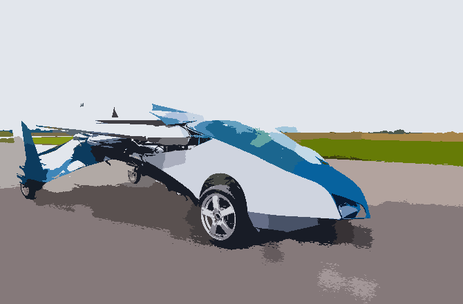

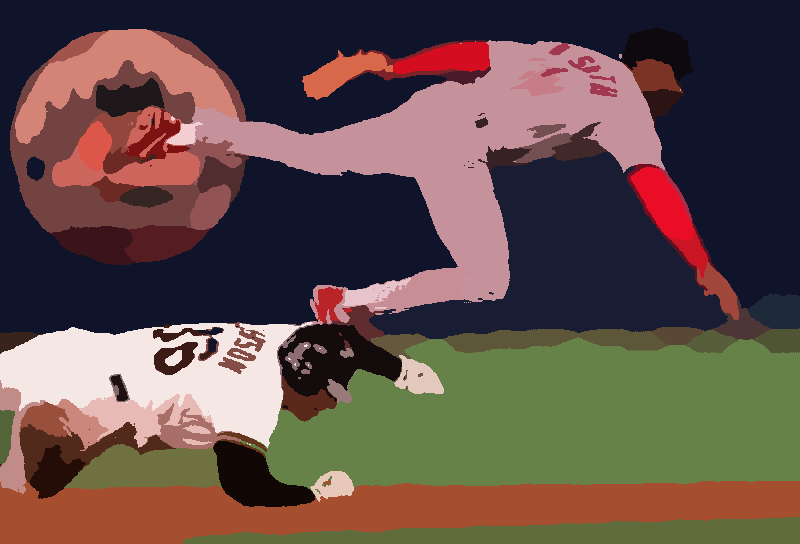

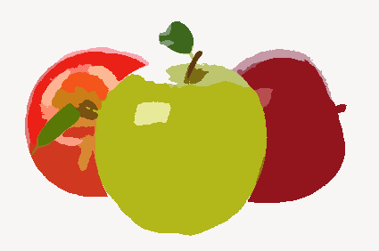


### Normalized Cut
Here is the code used.

```python
img = data.coffee()
img_lab = color.rgb2lab(img)
labels = segmentation.slic(img, compactness=30, n_segments=400)
rag_dist = graph.rag_mean_color(img_lab, labels,mode='similarity',sigma=100)
labels_new = graph.cut_normalized(labels, rag_dist, 0.01)
out = color.label2rgb(labels_new, img, kind='avg')
io.imsave('out.png', out)
```


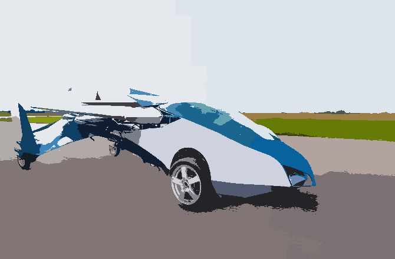

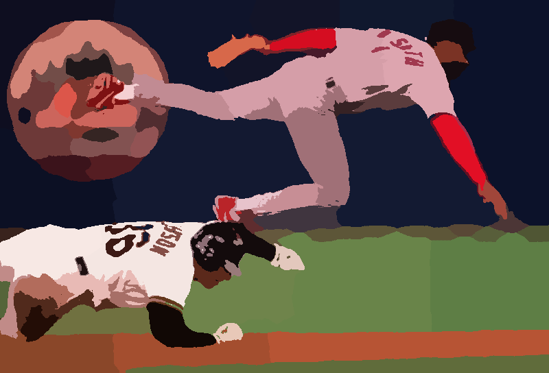

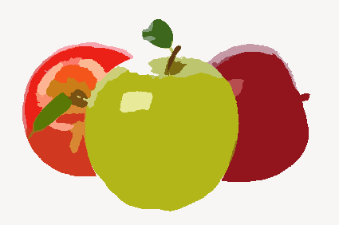


### Hierarchical Merging

The code.
```python
img = data.coffee()
img_lab = color.rgb2lab(img)
labels = segmentation.slic(img, compactness=30, n_segments=400)
rag_dist = graph.rag_mean_color(img_lab, labels)
labels_new = graph.merge_hierarchical(labels, rag_dist, 20)
out = color.label2rgb(labels_new, img, kind='avg')
io.imsave('out.png', out)
```


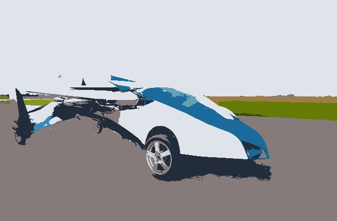

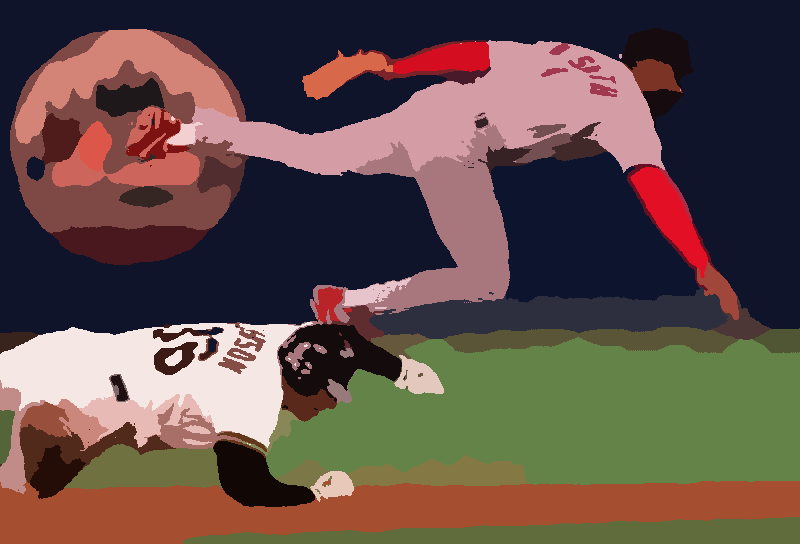


## General Comparison
To give each method the an equal chance, I tried the same input without playing around with the thresholds.

Here is the code I used. The thresholds do not change for any of the below outputs.

```python
from skimage import graph, data, io, segmentation, color
import time
from matplotlib import pyplot as plt

name = 'coffee'
sigma = 100.0
tcut_thresh = 10
ncut_thresh = 0.01
merge_thresh = 20

img = data.coffee()
img_lab = color.rgb2lab(img)
labels = segmentation.slic(img, compactness=30, n_segments=400)
rag_dist = graph.rag_mean_color(img_lab, labels)
rag_sim = graph.rag_mean_color(img_lab, labels,mode='similarity',sigma=sigma)

# Threshold
labels_new = graph.cut_threshold(labels, rag_dist,tcut_thresh,in_place=False)
out = color.label2rgb(labels_new, img, kind='avg')
io.imsave(name + '_' + 'threshold.png',out)

# NCut
labels_new = graph.cut_normalized(labels, rag_sim,ncut_thresh)
out = color.label2rgb(labels_new, img, kind='avg')
io.imsave(name + '_' + 'ncut.png',out)

# Merge
labels_new = graph.merge_hierarchical(labels, rag_dist,merge_thresh)
out = color.label2rgb(labels_new, img, kind='avg')
io.imsave(name + '_' + 'merge.png',out)

```

Here are the outputs.

## RAG Thresholding


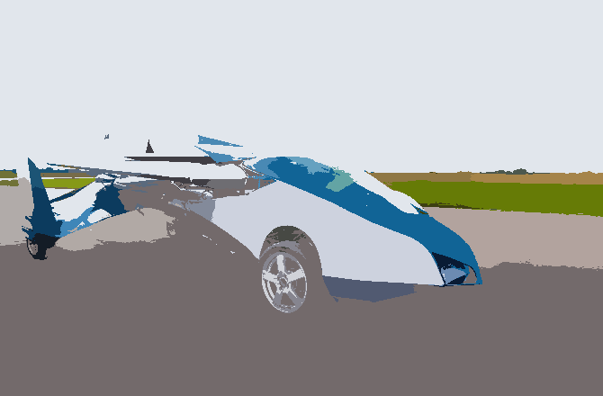

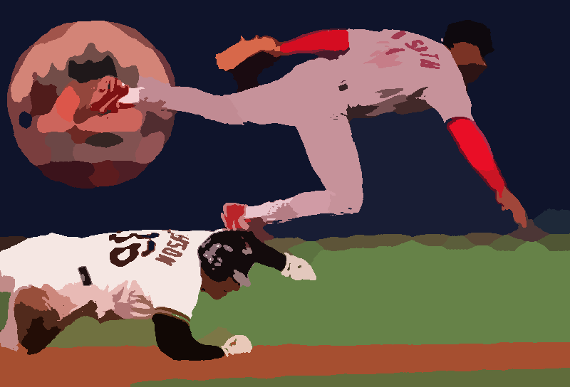


## Normalized Cut


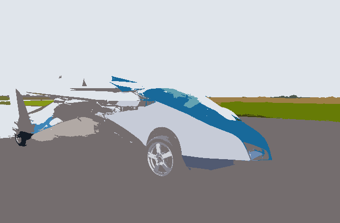

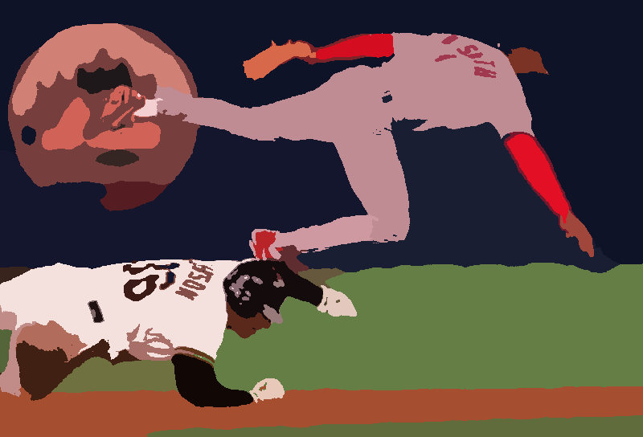


## Hierarchical Merging


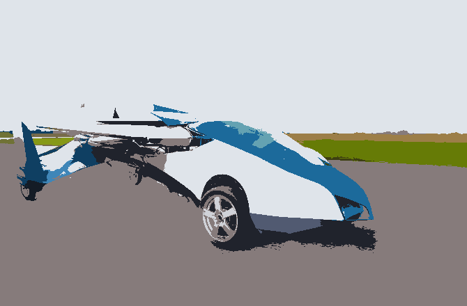

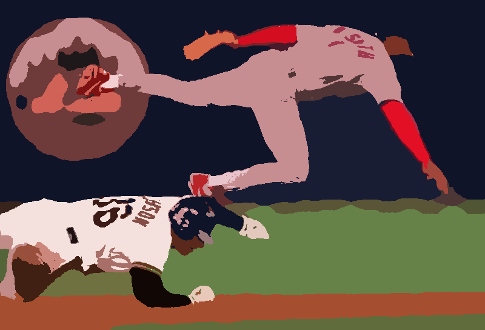


## Observations
From the General Comparison it is evident that the normalized cut is that most robust amongst the 3 ( it elminated the shadows is fruits and white regions on the coffee table). Hierarchical Merging and Thresolding require some adjustment of parameters to give good outputs.
