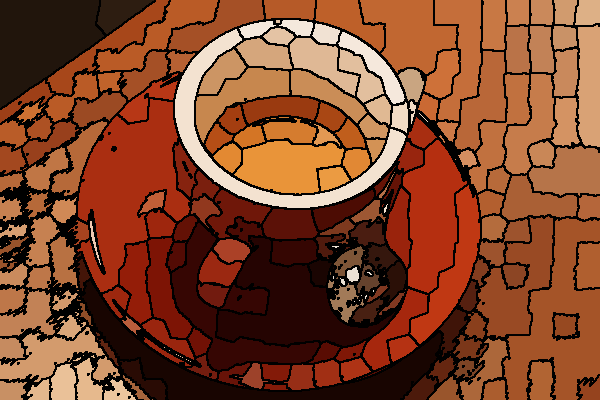

Hierarchical Merging of Region Adjacency Graphs
-----------------------------------------------

Region Adjacency Graphs model regions in an image as nodes of a graph with edges between adjacent regions. Superpixel methods tend to over segment images, ie, divide into more regions than necessary. Performing a [Normalized Cut](http://vcansimplify.wordpress.com/2014/07/29/normalized-cuts-on-region-adjacency-graphs/) and [Thresholding Edge Weights](http://vcansimplify.wordpress.com/2014/07/06/scikit-image-rag-introduction/) are two ways of extracting a better segmentation out of this. What if we could combine two small regions into a bigger one ? If we keep combining small similar regions into bigger ones, we will end up with bigger regions which are significantly different from its adjacent ones. **Hierarchical Merging** explores this possibility. The current working code can be found at this [Pull Request](https://github.com/scikit-image/scikit-image/pull/1100)


##Code Example


The `merge_hierarchical` function performs hierarchical merging on a RAG. It picks up the smallest weighing edge and combines the regions connected by it. The new region is adjacent to all previous neighbors of the two combined regions. The weights are updated accordingly. It continues doing so till the minimum edge weight in the graph in more than the supplied `thresh` value. The function takes a RAG as input where smaller edge weight imply similar regions. Therefore, we use the `rag_mean_color` function with the default `"distance"` mode for RAG contruction. Here is a minimal code snippet.

```
from skimage import graph, data, io, segmentation, color


img = data.coffee()
labels = segmentation.slic(img, compactness=30, n_segments=400)
g = graph.rag_mean_color(img, labels)
labels2 = graph.merge_hierarchical(labels, g, 40)
g2 = graph.rag_mean_color(img, labels2)

out = color.label2rgb(labels2, img, kind='avg')
out = segmentation.mark_boundaries(out, labels2, (0, 0, 0))
io.imsave('out.png',out)
```
I arrived at the threshold `40` after some trial and error. Here is the output.


The drawback here is that the `thresh` argument can vary  significantly depnding on image to image.

##Comparison with Normalized Cut

Loosely speaking the normalized cut follows a top-down approach where as the hierarchical merging follow a bottom-up approach. Normazlied Cut starts with the graph as a whole and breaks it down into smaller parts. On the other hand hierarchical merging, starts with individual regions and merges them into bigger ones till a criteria is reached. The Normalized Cut however, is much more robust and requires little tuning of its parameters as images change. Hierarchical merging is a lot faster, even though most of its computation logic is written in Python.

##Effect of change in threshold

Setting a very low threshold, will not merge any regions and will give us back the original image. A very large threshold on the other hand would merge all regions and give return the image as just one big blob. The effect is illustrated below.

#### `threshold=10`


#### `threshold=20`


#### `threshold=40`


#### `threshold=70`


#### `threshold=100`


## Hierarchical Merging in Action

With [this](https://github.com/vighneshbirodkar/scikit-image/compare/vighneshbirodkar:ha...ha_video) modification the following code can output the effect of all the intermediate segmentation during each iteration.

```
from skimage import graph, data, io, segmentation, color
import time
from matplotlib import pyplot as plt


img = data.coffee()
labels = segmentation.slic(img, compactness=30, n_segments=400)
g = graph.rag_mean_color(img, labels)
labels2 = graph.merge_hierarchical(labels, g, 60)

c = 0

out = color.label2rgb(graph.graph_merge.seg_list[-10], img, kind='avg')
for label in graph.graph_merge.seg_list:
    out = color.label2rgb(label, img, kind='avg')
    out = segmentation.mark_boundaries(out, label, (0, 0, 0))
    io.imsave('/home/vighnesh/Desktop/agg/' + str(c) + '.png', out)
    c += 1
```

I then used ``avconv -f image2 -r 3 -i %d.png -r 20 car.mp4`` to output a video. Below are a few examples.

In each of these videos, at every frame, a boundary dissapers. This means that the two regions seperated by that boundary are merged. The frame rate is 5 FPS, so more than one region might be merged at a time.

View the videos [here](https://www.dropbox.com/sc/rc6qnitxo6q81xd/AABJg3WBK_b92_sni5z1rgh6a)

