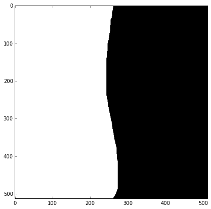
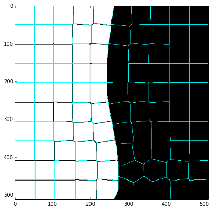
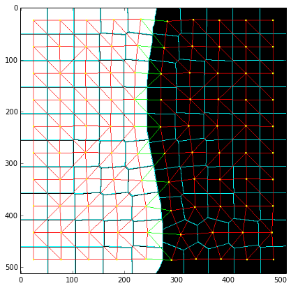
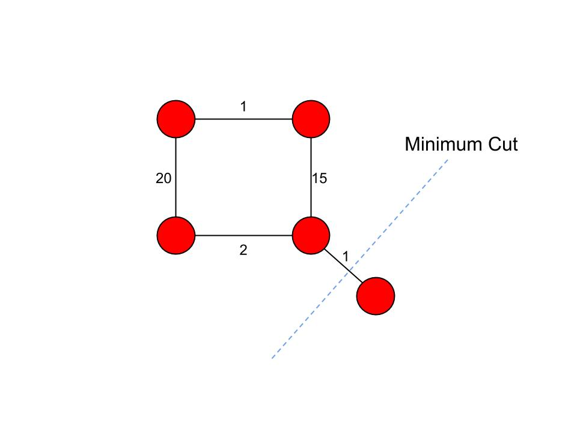
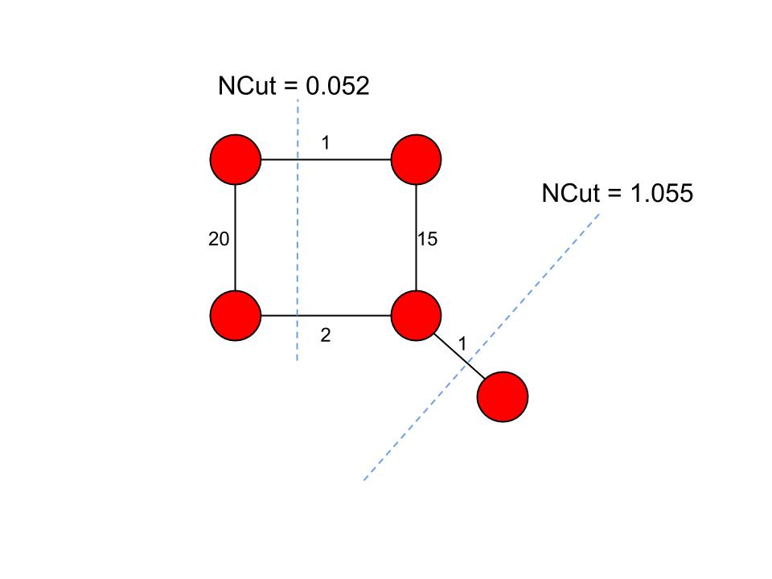
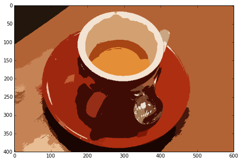
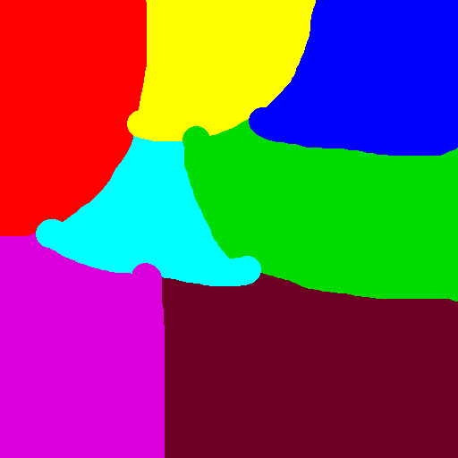

Normalized Cuts on Region Adjacency Graphs
------------------------------------------

In my last [post](http://vcansimplify.wordpress.com/2014/07/06/scikit-image-rag-
introduction/) I demonstrated how removing edges with high weights can leave us
with a set of disconnected graphs, each of which represents a region in the
image. The main drawback however was that the user had to supply a
**threshold**. This value varied significantly depending on the context of the
image. For a fully automated approach, we need an algorithm that can remove
edges automcatically.

The first thing that I can think of which does something useful in the above
mention situation is the [Minimum Cut](http://en.wikipedia.org/wiki/Minimum_cut)
Algorithm. It divides a graph into two parts, `A` and `B` such that the weight
of the edges going from nodes in Set `A` to the nodes in Set `B` is minimum.

For the **Minimum Cut** algorithm to work, we need to define the weights of our
Region Adjacency Graph (RAG) in such a way that similar regions have more
weight. This way, removing lesser edges would leave us with the similar regions.

## Getting Started
For all the examples below to work, you will need to pull from this [Pull
Request](https://github.com/scikit-image/scikit-image/pull/1080). The tests fail
due to outdated NumPy and SciPy verions on Travis. I have also submitted a [Pull
Request](https://github.com/scikit-image/scikit-image/pull/1082) to fix that.
Just like the last post, I have a `show_img` function.

    from skimage import graph, data, io, segmentation, color
    from matplotlib import pyplot as plt
    from skimage.measure import regionprops
    from skimage import draw
    import numpy as np
     
     
    def show_img(img):
        
        width = img.shape[1]/75.0
        height = img.shape[0]*width/img.shape[1]
        f = plt.figure(figsize=(width, height))
        plt.imshow(img)
     

I have modified the `display_edges` function for this demo. It draws nodes in
yellow. Edges with low edge weights are greener and edges with high edge weight
are nore red.

    def display_edges(image, g):
        """Draw edges of a RAG on its image
     
        Returns a modified image with the edges drawn. Edges with high weight are
        drawn in red and edges with a low weight are drawn in green. Nodes are drawn
        in yellow.
     
        Parameters
        ----------
        image : ndarray
            The image to be drawn on.
        g : RAG
            The Region Adjacency Graph.
        threshold : float
            Only edges in `g` below `threshold` are drawn.
     
        Returns:
        out: ndarray
            Image with the edges drawn.
        """
        
        image = image.copy()
        max_weight = max([d['weight'] for x, y, d in g.edges_iter(data=True)])
        min_weight = min([d['weight'] for x, y, d in g.edges_iter(data=True)])
        
        for edge in g.edges_iter():
            n1, n2 = edge
     
            r1, c1 = map(int, rag.node[n1]['centroid'])
            r2, c2 = map(int, rag.node[n2]['centroid'])
     
            green = 0,1,0
            red = 1,0,0
            
            line  = draw.line(r1, c1, r2, c2)
            circle = draw.circle(r1,c1,2)
            norm_weight = ( g[n1][n2]['weight'] - min_weight ) / ( max_weight - min_weight )
            
            image[line] = norm_weight*red + (1 - norm_weight)*green
            image[circle] = 1,1,0
     
        return image

To see demonstrate the `display_edges` function, I will load an image, which
just has two regions of black and white.

    demo_image = io.imread('bw.png')
    show_img(demo_image)

Let's compute the pre-segmenetation uusing the SLIC method. In addition to that,
we will also use `regionprops` to give us the centroid of each region to aid the
`display_edges` function.

    labels = segmentation.slic(demo_image, compactness=30, n_segments=100)
    labels = labels + 1  # So that no labelled region is 0 and ignored by regionprops
    regions = regionprops(labels)

We will use `label2rgb` to replace each region with it's average color. Since
the image is so monotonous, the difference is hardly noticable.

    label_rgb = color.label2rgb(labels, demo_image, kind='avg')
    show_img(label_rgb)

We can use `mark_boundaries` to display region boundaries.

    label_rgb = segmentation.mark_boundaries(label_rgb, labels, (0, 1, 1))
    show_img(label_rgb)

As mentioned earlier we need to contruct a graph with similar regions having
more weights between them. For this we supply the `"similarity"` option to
`rag_mean_color`.

    rag = graph.rag_mean_color(demo_image, labels, mode="similarity")
    
    
    for region in regions:
        rag.node[region['label']]['centroid'] = region['centroid']
    
    label_rgb = display_edges(label_rgb, rag)
    show_img(label_rgb)

If you notice above the black and white regions have red edges between them,
i.e. they are very similar. However the edges between the black and white
regions are green, indicating they are less similar.

## Problems with the min cut
Consider the following graph

    from IPython.core.display import Image 
    Image(width=500,filename="ncut_min.jpg")

The minimum cut approach has a tendency to seperate out small isolated regions
of the graph. This is undesirable for image segmentation as this would seperate
out small, relatively disconnected regions of the image. To counter this, we
used the **Normalized Cut**.

## The Normazlied Cut
It is defined as follows

    from IPython.core.display import Latex
    Latex(r"""
    Let $V$ be the set of all nodes and $w(u,v)$ for $ \in V$ be the edge weight between $u$ and $v$
    
    """)

Let $V$ be the set of all nodes and $w(u,v)$ for $ \in V$ be the edge weight between $u$ and $v$

    from IPython.core.display import Latex
    Latex(r"""
    $NCut(A,B) = \frac{cut(A,B)}{Assoc(A,V)} + \frac{cut(A,B)}{Assoc(B,V)} $
    
    """)

$NCut(A,B) = \frac{cut(A,B)}{Assoc(A,V)} + \frac{cut(A,B)}{Assoc(B,V)} $

    from IPython.core.display import Latex
    Latex(r"""
    $cut(A,B) = \sum_{a \in A ,b \in B}{w(a,b)} $
    
    """)

$cut(A,B) = \sum_{a \in A ,b \in B}{w(a,b)} $

    from IPython.core.display import Latex
    Latex(r"""
    $Assoc(X,V) = \sum_{x \in X ,v \in V}{w(x,v)} $
    
    """)

$Assoc(X,V) = \sum_{x \in X ,v \in V}{w(x,v)} $

With the above equation, **NCut** won't be low is any of **A** or **B** is not
well connected with the rest of the graph. Consider the same graph as the last
one.

    from IPython.core.display import Image 
    Image(width=500,filename="ncut_norm.jpg")

The idea of using Normalized Cut for segmenting images was first suggested by
Jianbo Shi and Jitendra Malik in their paper [Normalized Cuts and Image
Segmentation](http://www.cs.berkeley.edu/~malik/papers/SM-ncut.pdf). Instead of
pixels, we are considering RAGs as nodes.

The problem of finding NCut is [NP-Complete](http://en.wikipedia.org/wiki/NP-
complete). It is made tractable by an aproximation explained in Section 2.1 of
the paper. The function [_ncut_relabel](https://github.com/vighneshbirodkar
/scikit-image/blob/ncut/skimage/graph/graph_cut.py#L110) is reponsilble for
actually carrying out the NCut. It divides the graph into two parts, such that
the NCut is minimized. Then for each of the two parts, it recursively carries
out the same procedure until the NCut is unstable, i.e. it evaluates to a value
greater than the specified threshold. Here is a small snippet to illustrate.

## NCut Demo

    img = data.coffee()
    
    labels1 = segmentation.slic(img, compactness=30, n_segments=400)
    out1 = color.label2rgb(labels1, img, kind='avg')
    
    g = graph.rag_mean_color(img, labels1, mode='similarity')
    labels2 = graph.cut_normalized(labels1, g)
    out2 = color.label2rgb(labels2, img, kind='avg')
    
    show_img(out2)

## NCut in Action
To observe how the NCut works, I wrote a small hack. This shows us the regions
as divides by the method at every stage of recursion. The code relies on a
modification in the original code, which can be seen here.

    from skimage import graph, data, io, segmentation, color
    from matplotlib import pyplot as plt
    import os
    
    #img = data.coffee()
    os.system('rm *.png')
    img = io.imread('/home/vighnesh/Desktop/images/colors.png')
    #img = color.gray2rgb(img)
    
    labels1 = segmentation.slic(img, compactness=30, n_segments=400)
    out1 = color.label2rgb(labels1, img, kind='avg')
    
    g = graph.rag_mean_color(img, labels1, mode='similarity')
    labels2 = graph.cut_normalized(labels1, g)
    
    offset = 1000
    count = 1
    tmp_labels = labels1.copy()
    for g1,g2 in graph.graph_cut.sub_graph_list:
        for n,d in g1.nodes_iter(data=True):
            for l in d['labels']:
                tmp_labels[labels1 == l] = offset
        offset += 1
        for n,d in g2.nodes_iter(data=True):
            for l in d['labels']:
                tmp_labels[labels1 == l] = offset
        offset += 1        
        tmp_img = color.label2rgb(tmp_labels, img, kind='avg')
        io.imsave(str(count) + '.png',tmp_img)
        count += 1

The two components at each stage are stored in the form of tuples in
`sub_graph_list`. Let's say, the Graph was divided into `A` and `B` initially,
and later `A` was divided into `A1` and `A2`. The first iteration of the loop
will label `A` and `B`. The second iteration will label `A1`, `A2` and `B`, and
so on. I used the PNGs saved and converted them into a video with
[OpenShot](http://www.openshot.org/).GIFs would result in a loss of color, so I
made webm videos. Below are a few images and their respective successive NCuts.

https://dl.dropboxusercontent.com/u/74846509/colors.webm

During each iteration, one region (area of the image with the same color) is
split into two. A region is represented by its average color. Here's what
happens in the video

* The image is dvided into red, and the rest of the regions (gray at this point)
* The grey is divided into a dark pink region (pink, maroon and yellow) and a
dark green ( cyan, green and blue region ).
* The dark green region is divided into light blue ( cyan and blue ) and the
green region.
* The light blue region is divided into cyan and blue
* The dark pink region is divided into yellow and a darker pink (pink and marron
region.
* The darker pink region is divided into pink and maroon regions.

    
