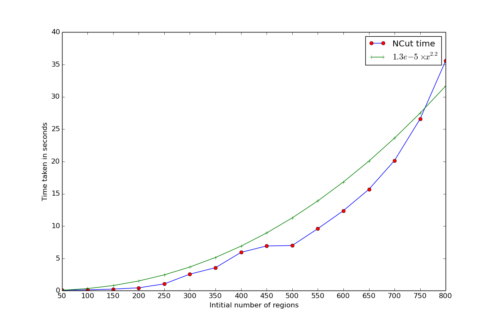

A closer look at NCut
---------------------

# Variation with number of regions


In this [post](http://vcansimplify.wordpress.com/2014/07/29/normalized-cuts-on-region-adjacency-graphs/) I explained how the Normalized Cut works and demonstrated some examples of it. This post aims to take a closer look at the code. I ran the following code to monitor the time taken by NCut with respect to initial number of regions.

```python
from skimage import graph, data, io, segmentation, color
import time
from matplotlib import pyplot as plt

image = data.coffee()
segment_list = range(50, 801, 50)


for nseg in segment_list:
    labels = segmentation.slic(image, compactness=30, n_segments=nseg)
    rag = graph.rag_mean_color(image, labels, mode='similarity')
    T = time.time()
    new_labels = graph.ncut(labels, rag)
    time_taken = time.time() - T
    out = color.label2rgb(new_labels, image, kind='avg')
    io.imsave('/home/vighnesh/Desktop/ncut/' + str(nseg) + '.png', out)
    print nseg, time_taken
```


By a little guess work, I figured that the curve approximately varies as ``x**2.2``. For 800 nodes, the time taken is around 35 seconds.

# Line Profile

I used [line profiler](https://pythonhosted.org/line_profiler/) to examine the time taken by each line of code in `threshold_normalized`. Here are the results.

```
   218                                           @profile
   219                                           def _ncut_relabel(rag, thresh, num_cuts):
   220                                               """Perform Normalized Graph cut on the Region Adjacency Graph.
   221                                           
   222                                               Recursively partition the graph into 2, until further subdivision
   223                                               yields a cut greather than `thresh` or such a cut cannot be computed.
   224                                               For such a subgraph, indices to labels of all its nodes map to a single
   225                                               unique value.
   226                                           
   227                                               Parameters
   228                                               ----------
   229                                               labels : ndarray
   230                                                   The array of labels.
   231                                               rag : RAG
   232                                                   The region adjacency graph.
   233                                               thresh : float
   234                                                   The threshold. A subgraph won't be further subdivided if the
   235                                                   value of the N-cut exceeds `thresh`.
   236                                               num_cuts : int
   237                                                   The number or N-cuts to perform before determining the optimal one.
   238                                               map_array : array
   239                                                   The array which maps old labels to new ones. This is modified inside
   240                                                   the function.
   241                                               """
   242        59       218937   3710.8      3.2      d, w = _ncut.DW_matrices(rag)
   243        59          151      2.6      0.0      m = w.shape[0]
   244                                           
   245        59           61      1.0      0.0      if m > 2:
   246        44         3905     88.8      0.1          d2 = d.copy()
   247                                                   # Since d is diagonal, we can directly operate on its data
   248                                                   # the inverse of the square root
   249        44          471     10.7      0.0          d2.data = np.reciprocal(np.sqrt(d2.data, out=d2.data), out=d2.data)
   250                                           
   251                                                   # Refer Shi & Malik 2001, Equation 7, Page 891
   252        44        26997    613.6      0.4          vals, vectors = linalg.eigsh(d2 * (d - w) * d2, which='SM',
   253        44      6577542 149489.6     94.9                                       k=min(100, m - 2))
   254                                           
   255                                                   # Pick second smallest eigenvector.
   256                                                   # Refer Shi & Malik 2001, Section 3.2.3, Page 893
   257        44          618     14.0      0.0          vals, vectors = np.real(vals), np.real(vectors)
   258        44          833     18.9      0.0          index2 = _ncut_cy.argmin2(vals)
   259        44         2408     54.7      0.0          ev = _ncut.normalize(vectors[:, index2])
   260                                           
   261        44        22737    516.8      0.3          cut_mask, mcut = get_min_ncut(ev, d, w, num_cuts)
   262        44           78      1.8      0.0          if (mcut < thresh):
   263                                                       # Sub divide and perform N-cut again
   264                                                       # Refer Shi & Malik 2001, Section 3.2.5, Page 893
   265        29        78228   2697.5      1.1              sub1, sub2 = partition_by_cut(cut_mask, rag)
   266                                           
   267        29          175      6.0      0.0              _ncut_relabel(sub1, thresh, num_cuts)
   268        29           92      3.2      0.0              _ncut_relabel(sub2, thresh, num_cuts)
   269        29           32      1.1      0.0              return
   270                                           
   271                                               # The N-cut wasn't small enough, or could not be computed.
   272                                               # The remaining graph is a region.
   273                                               # Assign `ncut label` by picking any label from the existing nodes, since
   274                                               # `labels` are unique, `new_label` is also unique.
   275        30          685     22.8      0.0      _label_all(rag, 'ncut label')
```
The output of each iteration can be seen here.
http://imgur.com/a/ojR1n?gallery

As you can see above 95% of the time is taken by the call to [eigsh](http://docs.scipy.org/doc/scipy-0.14.0/reference/generated/scipy.sparse.linalg.eigsh.html). The function is used to solve the eigenvalue problem for a symmetric hermitian matrix. It in turn relies on a library called [APPack](http://www.caam.rice.edu/software/ARPACK/). As documented [here](http://docs.scipy.org/doc/scipy/reference/tutorial/arpack.html) ARPack isn't very good at finding the smallest eigenvectors. If the value supplied as the argument `k` is too less, we get the `ArpackNoConvergence` Exception. Although the [original paper](http://www.cs.berkeley.edu/~malik/papers/SM-ncut.pdf) claims that the problem can be solved in ``O(n)`` with [Lanczos Method](http://en.wikipedia.org/wiki/Lanczos_algorithm), ARPack is taking it towards slightly more than ``O(n^2)``

Since the problem is specific to ARPack, using other libraries might lead to faster computation. [slepc4py](https://code.google.com/p/slepc4py/) is one such BSD liscensed library. The possibility of optionally importing `slec4py` should be certainly explored in the near future. 

Also, we can optionally ask the user for a function to solve the eigenvalue problen, so that he can use a matrix library of his choice if he/she so desires.

# Final Thoughts
Although the current Normalized Cut implementation taken more than quadratic time, the preceding over segmentation method does most of the heavy lifting. With something like SLIC, we can be sure of the number of nodes irrespective of the input image size. Although, a better eigenvalue finding technique would immensely improve its performance.

