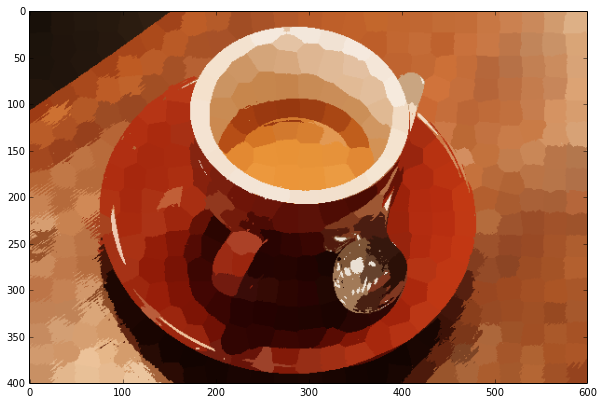
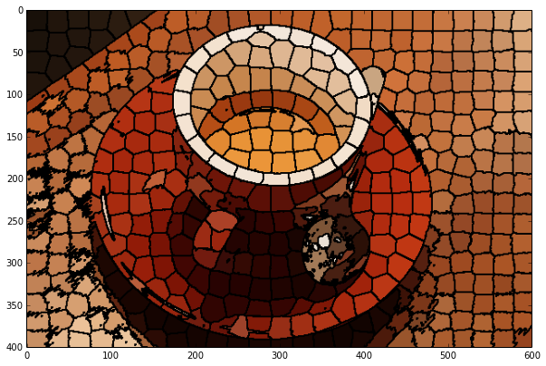
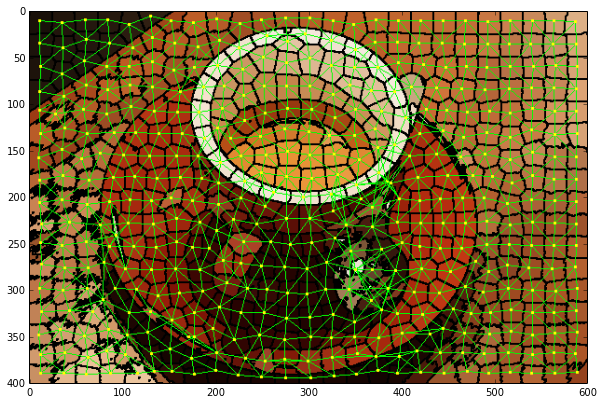
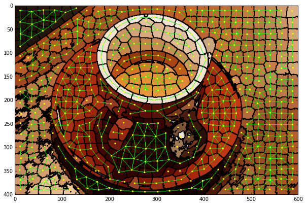
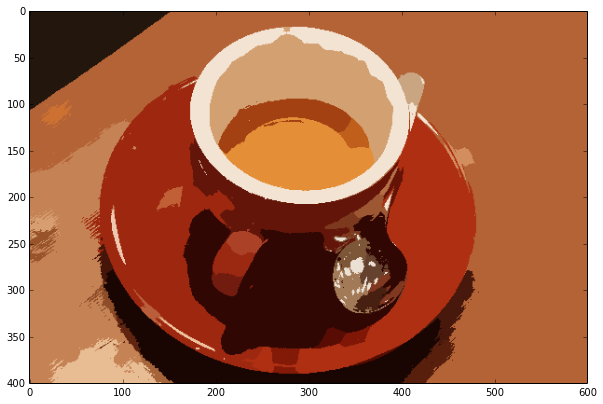

#scikit-image RAG Introduction

Humans possess an incredible ability to identify objects in an image. Image
processing algorithms are still far behind this ability. **Segmentation** is the
process of dividing an image into meaningful regions. All pixels belonging to a region
should get a unique label in an ideal segmentation.

The current segmentation functions in scikit-image are too fine grained and fall closer
to superpixel methods, providing a starting point for segmentation. Region Adjacency Graphs (RAGs)
are a common data structure for many segmentation algorithms. As part of [GSoC](http://www.google-melange.com/gsoc/project/details/google/gsoc2014/vighneshbirodkar/5874785116487680) this year I am implementing
RAGs for scikit-image. The current HEAD of scikit-image's master branch contains my RAG implementation
based on [Networkx](https://networkx.github.io/) from my recent [Pull Request](https://github.com/scikit-image/scikit-image/pull/1031).
In the example below, we will see how Region Adjacency Graphs (RAGs) attempt to
solve the segmentation problem.Please note that you need the lastest [master](https://github.com/scikit-image/scikit-image) branch of scikit-image to run the following code.


# Getting Started
We define the function `show_img` in preference to the standard call to `imshow` to set nice default size parameters.
We start with `coffee`, a nice fresh image of a coffee cup.
```python
from skimage import graph, data, io, segmentation, color
from matplotlib import pyplot as plt
from skimage.measure import regionprops
from skimage import draw
import numpy as np


def show_img(img):
    width = 10.0
    height = img.shape[0]*width/img.shape[1]
    f = plt.figure(figsize=(width, height))
    plt.imshow(img)

img = data.coffee()
show_img(img)

```


# Over Segmentation
We segment the image using SLIC algorithm. The SLIC algorithm will
assign a unique label to each **region**. This is a
localized cluster of pixels sharing some similar property, in this case their
color. The label of each pixel is stored in the `labels` array.

`regionprops` helps us compute various features of these regions. We will be
sing the centroid, purely for visualization.
```python
labels = segmentation.slic(img, compactness=30, n_segments=400)
labels = labels + 1  # So that no labelled region is 0 and ignored by regionprops
regions = regionprops(labels)
```

The `label2rgb` function assigns a specific color to all pixels belonging to one
region (having the same label). In this case, in `label_rgb` each pixel is
replaces with the average `RGB` color of its region.

```python
label_rgb = color.label2rgb(labels, img, kind='avg')
show_img(label_rgb)
```





Just for clarity, we use `mark_boundaries` to highlight the region boundaries.
You will notice the the image is divided into more regions than required. This
phenomenon is called **over-segmentation**.

```python
label_rgb = segmentation.mark_boundaries(label_rgb, labels, (0, 0, 0))
show_img(label_rgb)
```




# Enter, RAGs

Region Adjacency Graphs, as the name suggests represent adjacency of regions
with a graph. Each region in the image is a node in a graph. There is an edge
between every pair of adjacent regions (regions whose pixels are adjacent). The
weight of between every two nodes can be defined in a variety of ways. For this
example, we will use the difference of average color between two regions as
their edge weight. The more similar the regions, the lesser the weight between
them. Because we are using difference in mean color to compute the edge weight,
the method has been named `rag_mean_color`.

```python
rag = graph.rag_mean_color(img, labels)
```
For our visualization, we are also adding an additional property to a node, the
coordinated of its centroid.

```python
for region in regions:
    rag.node[region['label']]['centroid'] = region['centroid']
```
`display_edges` is a function to draw the edges of a RAG on its cooresponding
image. It draws edges as green lines and centroids as yellow dots.
It also accepts an argument, `thresh`. We only draw edges with weight below this threshold.
```python
def display_edges(image, g, threshold):
    """Draw edges of a RAG on its image
    
    Returns a modified image with the edges drawn.Edges are drawn in green
    and nodes are drawn in yellow.
    
    Parameters
    ----------
    image : ndarray
        The image to be drawn on.
    g : RAG
        The Region Adjacency Graph.
    threshold : float
        Only edges in `g` below `threshold` are drawn.
        
    Returns:
    out: ndarray
        Image with the edges drawn.
    """
    image = image.copy()
    for edge in g.edges_iter():
        n1, n2 = edge
        
        r1, c1 = map(int, rag.node[n1]['centroid'])
        r2, c2 = map(int, rag.node[n2]['centroid'])

        line  = draw.line(r1, c1, r2, c2)
        circle = draw.circle(r1,c1,2)

        if g[n1][n2]['weight'] < threshold :
            image[line] = 0,1,0
        image[circle] = 1,1,0

    return image
```
We call the function with `thresh = infinity` so that all edges are drawn. I
myself was surprised with the beauty of the following output.

```python
edges_drawn_all = display_edges(label_rgb, rag, np.inf )
show_img(edges_drawn_all)
```




Let's see what happens by setting `thresh` to `30`, a value I arrived at with
some trial and error.

```python
edges_drawn_30 = display_edges(label_rgb, rag, 30 )
show_img(edges_drawn_30)
```





### Alas, the graph is cut

As you can see above, the RAG is now divided into disconnected regions. If you
notice, the table above and to the right of the dish is one big connected
component.

# Threshold Cut

The function `cut_threshold` removes edges below a specified threshold and then
labels a connected component as one region. Once the RAG is constructed, many similar
and more sophisticated strategies can improve the initial segmentation.

```python
final_labels = graph.cut_threshold(labels, rag, 30)
final_label_rgb = color.label2rgb(final_labels, img, kind='avg')
show_img(final_label_rgb)
```




Not perfect, but not that bad I'd say. My next steps will be to implement better algorithms to process the RAG after the initial segmentation.These include the merging predicates mention [here](http://citeseerx.ist.psu.edu/viewdoc/summary?doi=10.1.1.11.5274) and [N-cut](http://www.cs.berkeley.edu/~malik/papers/SM-ncut.pdf).


    
