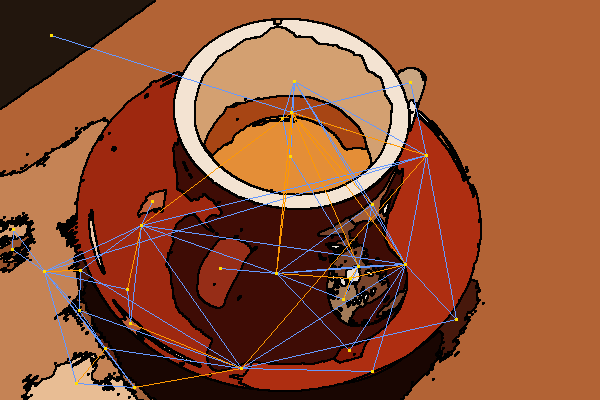

Region Adjacency Graphs Drawing
-------------------------------

A lot of Image Processing algorithms are based on intuition from visual cues.
Region Adjacency Graphs would also benifit if they were somwhow drawn back on
the images they represent. If we are able to see the nodes, edges, and the edges
weights, we can fine tune our parameters and algorithms to suit our needs. I had
written a small hack in this [blog
post](http://vcansimplify.wordpress.com/2014/07/06/scikit-image-rag-
introduction/) to help better visualize the results. Later,
[Juan](http://www.janelia.org/people/juan-nunez-iglesias) suggested I port if
for scikit-image. It will indeed be a very helpful tool for anyone who wants to
explore RAGs in scikit-image.

## Getting Started

You will need to pull for [this](https://github.com/scikit-image/scikit-
image/pull/1087) Pull Request to be able to execute the code below. I'll start
by defining a custom `show_image` function to aid displaying in IPython
notebooks.


```python
from skimage import graph, data, io, segmentation, color
from matplotlib import pyplot as plt
from skimage.measure import regionprops
import numpy as np
from matplotlib import colors

def show_image(img):
    width = img.shape[1]/50.0
    height = img.shape[0]*width/img.shape[1]
    f = plt.figure(figsize=(width, height))
    plt.imshow(img)
```

We will start by loading a demo image just containing 3 bold colros to help us
see how the `draw_rag` function works.

```python
image = io.imread('/home/vighnesh/Desktop/images/colors.png')
show_image(image)
```


We will now use the SLIC algorithm to give us an over-segmentation, on which we
will build our RAG.

```python
labels = segmentation.slic(image, compactness=30, n_segments=400)
```
Here's what the over-segmentation looks like.

```python
border_image = segmentation.mark_boundaries(image, labels, (0,0,0))
show_image(border_image)
```


## Drawing the RAGs
We can now form out RAG and see how it looks.

```python
rag = graph.rag_mean_color(image, labels)
out = graph.draw_rag(labels, rag, border_image)
show_image(out)
```


In the above image, nodes are shown in yellow whereas edges are shown in green.
Each region is represented by its centroid. But as you can see, no single edge
color may be prominent accross the entire image. For this reason, we support the
`desaturate` argument. It converts the image to grayscale before displaying.

```python
out = graph.draw_rag(labels, rag, border_image, desaturate=True)
show_image(out)
```


Although the above image does very well to show us individual regions and their
adjacency relationships, it does nothing to show us the magnitutde of edges. To
give us more information about the magnitude of edges, we have the `colormap`
option. It colors edges between the first and the second color depending on
their weight.

```python
blue_red = colors.ListedColormap(['blue','red'])
out = graph.draw_rag(labels, rag, border_image, desaturate=True,colormap=blue_red)
show_image(out)
```


As you can see, the edges between similar regions are blue, whereas edges
between dissimilar regions are red. `draw_rag` also accepts a `thresh` option.
All edges above `thresh` are not considered for drawing.


```python
out = graph.draw_rag(labels, rag, border_image, desaturate=True,colormap=blue_red, thresh=10)
show_image(out)
```


Another clever trick is to supply a blank image, this way, we can see the RAG
unobstructed.

```python
cyan_red = colors.ListedColormap(['cyan','red'])
out = graph.draw_rag(labels, rag, np.zeros_like(image), desaturate=True,colormap=cyan_red)
show_image(out)
````


**Ahhh, magnificent.**

## Examples
I will go over some examples of RAG drawings, since most of it is similar, I won't repeat the 
code here. The Ncut technique, wherever used, was with its default parameters.

### Color distance RAG of Coffee on black background


### Color distance RAG of Coffee after applying NCut


### Color distance RAG of Lena


### A futurustic car and its color distance RAG after NCut


### Coins Image and their color distance RAG after NCut


## Further Imporovements
A point that was brought up in the PR as well is that thick lines would immensely enhance the visual
appeal of the output. As and when they are implemented, `rag_draw` should be modified to support drawing
thick edges.